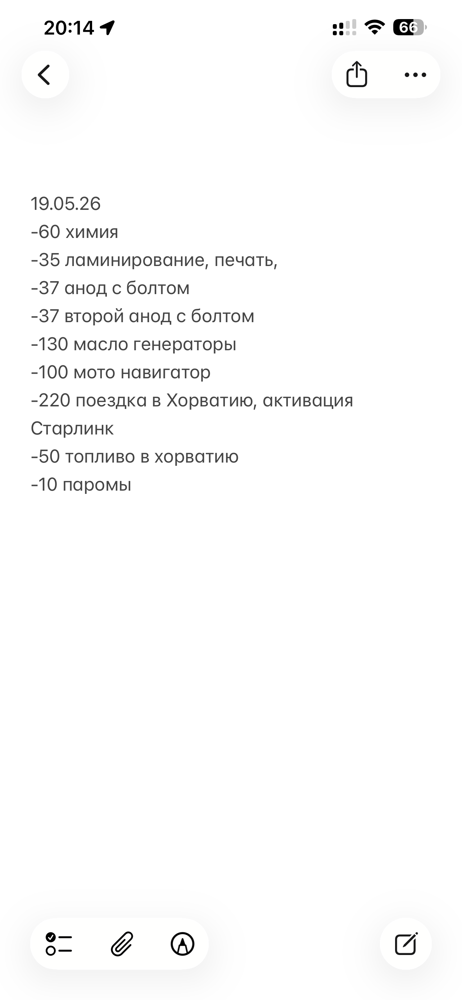
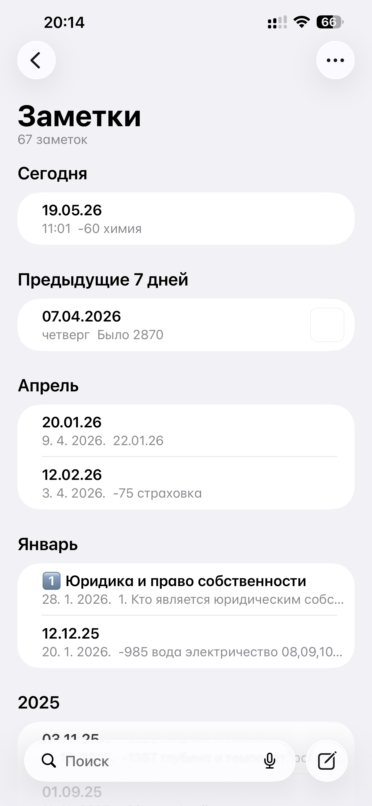

# Handoff: On-The-Go Intermediate Cards Page

Date: 2026-05-21
Project: `/home/alexey/GitHub/finance.brkovic.ltd`
Local URL now used for testing: `http://127.0.0.1:18889/reset-local.php`

## Start Here Instead

This file only describes the narrow last UI task. For the full project model, roles, entities, access levels and screen responsibilities, read this first:

`docs/HANDOFF_FULL_PRODUCT_2026-05-21.md`

## User Clarification

The user clarified that the "blank/white screen" problem was not a crash. It was the newly created empty working page after saving a report. That empty page has no records, so it feels like a broken blank screen. Even after creating a record, the screen does not feel structurally correct.

The user explicitly said the current implementation drifted into random fixes. The next task is not to keep patching calculations blindly. The task is to design and implement the correct intermediate page flow.

## Last Task To Solve

Create a normal intermediate page for "На бегу" based on the user's original request:

- After pressing `Сохранить отчет` in `На бегу`, do not leave the user staring at an empty new report editor.
- Open a full-screen intermediate page with all saved cards, similar in meaning to the iPhone Notes list.
- The page must have a `+` button for a new report.
- Each saved card must be readable, compact, and obviously tappable.
- A saved card can be opened, edited, or deleted.
- For an admin, cards also need:
  - a transition to `FinDesk`;
  - an approval/submission flag/action that moves a report into the next FinDesk stage.
- The old first FinDesk column/card ("Текущий отчет") should not duplicate this intermediate page. The intermediate page becomes the place where current saved on-the-go cards live.

## iPhone Notes References

These are the visual/interaction references supplied by the user. They were copied into the repo for the next chat:

There was no separate local handoff for iPhone Notes algorithms before 2026-05-21. The only local references were the two screenshots below. The behavioral handoff created from those references is:

```text
docs/IPHONE_NOTES_UX_ALGORITHMS_2026-05-21.md
```

### Notes List Reference



Use this for the intermediate cards page:
- full-screen list;
- large clear title;
- date/group sections;
- compact note/card rows;
- round navigation/action buttons;
- not a landing page, not a dashboard card stack.

### Note Editor Reference



Use this for the card editor/opened report:
- back button returns to the cards list;
- editing happens inside a focused full-screen detail view;
- save should not trap the user in a visually empty report.

Original downloaded zip was:

`/home/alexey/Загрузки/drive-download-20260521T182037Z-3-001.zip`

Temporary extraction was:

`/tmp/iphone-notes-ref-27253/IMG_3038.PNG`
`/tmp/iphone-notes-ref-27253/IMG_3039.PNG`

## Current State

Relevant files:

- `public/app.php`
- `public/assets/app.js`
- `public/assets/app.css`
- `app/on_the_go.php`
- `public/api.php`
- `public/reset-local.php`
- `scripts/start-local.sh`

Recent local launcher change:

- Plank item `captain-fin.dockitem` points to `~/.local/share/applications/captain-fin.desktop`.
- That desktop file was changed to run:
  `/home/alexey/GitHub/finance.brkovic.ltd/scripts/start-local.sh`
- This starts local FinDesk on port `18889`.

Current cache/local fixes:

- `app.php` and `index.php` send no-store cache headers.
- Service worker is disabled/unregistered on `127.0.0.1` and `localhost`.
- `reset-local.php` clears old local service worker/cache and redirects to `app.php`.
- Current asset version in HTML: `20260521-19`.
- Current service-worker cache name: `findesk-20260521-v56`.

Current behavioral state after last patch:

- After saving, the backend can create/keep a new active empty tape.
- The editor can show an empty new tape with the carried balance.
- The user rejects this as the main experience because it reads like an empty/broken page.
- The desired flow is: save -> show saved cards list; plus -> new report; open card -> focused editor.

## Important Concept

Do not treat "На бегу" / "Живой отчет" as one endless editor.

The user wants the mobile app split into two screens:

1. Cards/list screen: like the left column of the desktop app, but full-screen on mobile.
2. Editor/detail screen: like the right column/open note, where the current selected report is edited.

This is the exact meaning of "one desktop screen split into two mobile screens."

Accounting boundary:

- Admin "Живой отчет" is the administrator's own operational report and its base comes from the Advanced/group cash position.
- "Подотчеты" are employee reports against issued accountable money. They are separate live-report tapes created by `advance_create` and linked through `cash_advances.on_the_go_tape_id`.
- Opening an employee podotchet must open that exact tape with its original rows and issued amount. Saving it must preserve the issued amount from Advanced.
- The common report is assembled later from the admin's own live report plus submitted/accepted employee podotchets for the selected period.

## Device Layout Rule

This is a project-level requirement, not a one-off CSS tweak.

Build and preserve three layout paths:

- **Mobile (`max-width: 700px`)**: primary field workflow. It should feel like iPhone Notes: list screen and opened note/report screen, large tap targets, minimal text, camera/scanner/media actions.
- **Tablet (`701px` through `1099px`)**: wider operational workspace. It can use two internal columns in the editor, but must still keep the list/detail mental model.
- **Desktop (`1100px+`)**: professional centered work canvas or split layout. Do not stretch the live report across the full browser width.

Reason: this product is used in motion. Nobody runs around stores with a laptop. The mobile interaction is the canonical "Живой отчет" experience; tablet and desktop adapt from it rather than flattening it.

## Proposed Implementation Direction

Add/reshape the On-The-Go UI into a small state machine:

- `list`: full-screen cards list, default after save.
- `edit`: opened report editor.
- `new`: create a blank report and immediately open it in edit mode.

Expected mobile flow:

1. Open `На бегу`.
2. If there is a current unsaved/active working report with rows, open editor for it.
3. If no rows, show the list screen instead of a visually empty editor.
4. Tap `+` to create a new blank report editor.
5. Save report:
   - report appears in the list;
   - list remains/opened;
   - user can tap `+` for a new report when ready.
6. Tap existing card:
   - open full-screen editor/detail;
   - edits update the same card, not duplicate it.
7. Delete:
   - confirm first;
   - archive/delete the card;
   - return to list.
8. Admin:
   - can approve/submit from card/list or detail;
   - can open `FinDesk` from the list;
   - FinDesk receives cards after explicit action, not automatically just because save happened.

## Acceptance Criteria

- The screen after saving is not visually empty.
- There is a clear, iOS Notes-like saved cards page.
- `+` creates a new report.
- Back from editor returns to list and preserves edits.
- Card delete is available and confirmed.
- Admin has `FinDesk` transition and approval/submission action.
- No duplicate "open/open" buttons.
- No duplicate first FinDesk current-report column if the intermediate page replaces it.
- Mobile, tablet and desktop each have explicit layout behavior.
- Do not add explanatory marketing text inside the app.
- Keep the UI premium/light/iOS-glass, but prioritize structure before polish.

## Caution For Next Chat

There are many dirty files from the broader build. Do not run destructive git commands or reset user work. Avoid continuing broad refactors. The user's immediate ask is the intermediate cards page and correct report flow, not Advanced/Excel/AI cleanup.

Before editing, inspect:

```bash
git status --short
rg -n "otrReportCardsPanel|otrSimpleNotes|on_the_go_signed_sync|qlOpenOtrReportCards|ql_on_the_go_card_list|ql_on_the_go_signed_sync" public/assets/app.js public/app.php app/on_the_go.php
```

Verification commands used recently:

```bash
php -l app/on_the_go.php
php -l public/app.php
php -l public/index.php
node --check public/assets/app.js
git diff --check
php scripts/local-smoke.php http://127.0.0.1:18889
```

Physical check should use the real local URL:

`http://127.0.0.1:18889/reset-local.php`
